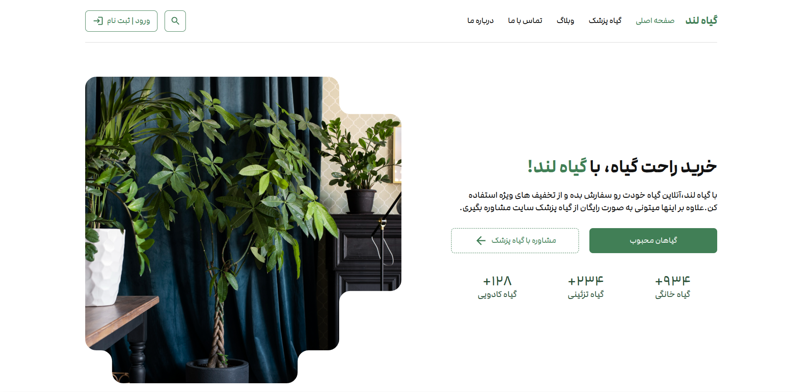
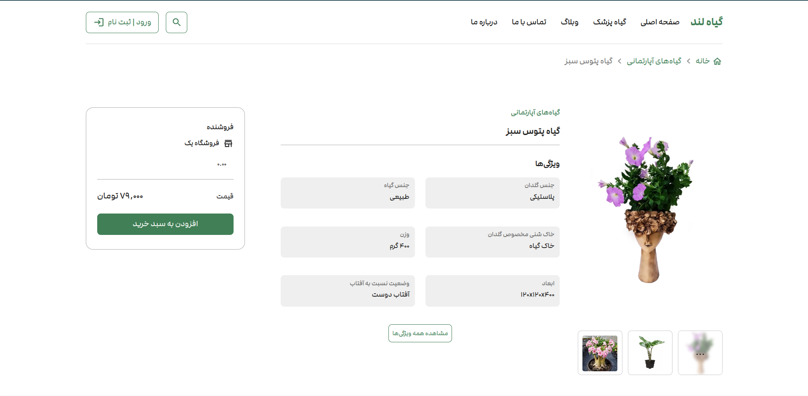
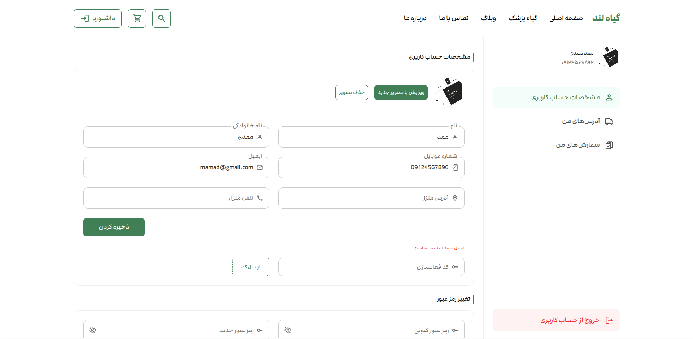
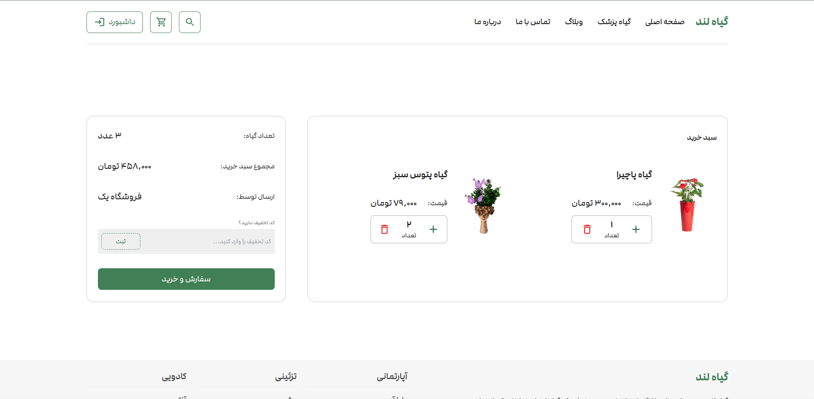

# Giahland

Giahland is a Flower Selling project built using React and Vite, TailwindCSS.

## Table of Contents
- [Overview](#overview)
- [Preview](#preview)
- [Live Demo](#live-demo)
- [Features](#features)
- [Installation](#installation)
- [Usage](#usage)
- [Technologies Used](#technologies-used)
- [Contributing](#contributing)
- [Contact](#contact)

## Overview
This Project is a website that hosts different sellers from across the country and they can put the flowers they want to sell in the website. This Project is gonna have 3 panels, one for users, one for sellers and the last one for admins. This project's purpose is to demonstrate my knowledge in front-end development.

## Preview
### Home Page


### Product Details


### User Dashboard


### Shopping Cart


## Live Demo
You can see the project online in [this link](https://giahland-frontend.liara.run/). you can sign up and test the project on your own.

## Features
- Authentication System with fully connected sign up, login and reset password page to backend
- Detailed Home page connected to backend
- Detailed Product page in which you can see similar products, submit comments and see others comments, add product to your cart and change quantity, and other details
- Fully connected User Dashboard with many tabs such as User Info, User Addresses, ...
- Detailed Cart page connected to backend

## Installation
To get started with Giahland, follow these steps:

1. **Clone the repository**:
    ```bash
    git clone https://github.com/Amin-Gharibi/Giahland.git
    cd Giahland
    ```

2. **Install dependencies**:
    ```bash
    npm install
    ```

3. **Start the development server**:
    ```bash
    npm run dev
    ```

## Usage
To use Giahland, follow these steps:

1. **Running the development server**:
    ```bash
    npm run dev
    ```
    This command will start the Vite development server with Hot Module Replacement enabled.

2. **Building for production**:
    ```bash
    npm run build
    ```
    This command will build the project for production.

## Technologies Used


## Contributing
We welcome contributions to Giahland! To contribute, follow these steps:

1. **Fork the repository**.

2. **Create a new branch**:
    ```bash
    git checkout -b feature/your-feature-name
    ```

3. **Make your changes**.

4. **Commit your changes**:
    ```bash
    git commit -m "Add your commit message"
    ```

5. **Push to the branch**:
    ```bash
    git push origin feature/your-feature-name
    ```

6. **Create a pull request**.

## Contact
If you have any questions or issues, please feel free to reach out:

- **Email**: [mohdamingharibi@gmail.com](mailto:mohdamingharibi@gmail.com)
- **Telegram**: [@theAminGharibi](https://t.me/theAminGharibi)
